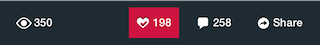
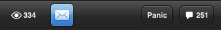

.. include:: feedback_widget.rst

=========================================
Socialize Action Bar
=========================================

Introduction
------------

The Socialize Action Bar is a prebuilt control that exposes some core Socialize
functionality.  It is a relatively simple drop-in component and can quickly be
added to any app that might benefit from additional social features. The Action
Bar is customizable, so you can pick and choose which components you'd like
displayed.

.. note:: If you have been using the Socialize Action Bar from previous releases, you should note that the new action bar (SZActionBar) is incompatible with the old (SocializeActionBar). To upgrade from the old action bar to the new, you will have to update your code. The main difference is that the new action bar is a UIView subclass.

Displaying the Action Bar
-------------------------

Simple Display
~~~~~~~~~~~~~~

The simplest way to use the action bar is just by calling
**showActionBarInViewController:entity:options:** on the **SZActionBarUtils**
class.

.. literalinclude:: snippets/create_action_bar.h

.. literalinclude:: snippets/create_action_bar.m
  :start-after: begin-simple-create-snippet
  :end-before: end-simple-create-snippet

Manual Display
~~~~~~~~~~~~~~

Since the action bar is just a UIView subclass, you can instantiate one
yourself If you initialize the view with a frame of CGRectNull (or if
**SZActionBarUtils** is used), the Action Bar will automatically place itself
at the bottom of its superview and adjust to rotation.

.. literalinclude:: snippets/create_action_bar.m
  :start-after: begin-default-view-create-snippet
  :end-before: end-default-view-create-snippet

Manual Display with Custom Frame
~~~~~~~~~~~~

If you'd like the bar to appear somewhere else, you can initialize the bar with
a custom frame.

If you do this, you should note that the default autoresizing mask for the
action bar is UIViewAutoresizingFlexibleWidth |
UIViewAutoresizingFlexibleTopMargin, which is suitable for a bar that hugs the
buttom of a view. If you wish to display the bar somewhere else, you should
adjust the autoresizing mask accordingly, as below.

.. literalinclude:: snippets/create_action_bar.m
  :start-after: begin-top-view-create-snippet
  :end-before: end-top-view-create-snippet

Manual Display with Custom Buttons
~~~~~~~~~~~~~~~~~~~~~~~~~~~~~~~~~~

If you don't like the default buttons on the bar, or if you'd like to add your
own, you can do so by changing the **itemsLeft** and **itemsRight** properties.
If you change these properties, you should specify an NSArray with elements of
type UIView. You can also take advantage of the SZActionButton class, which
allows you to specify both an **actionBlock** and an
**entityConfigurationBlock**.  The following example shows how you might add
both an email and a panic button to the action bar.

.. literalinclude:: snippets/create_action_bar.m
  :start-after: begin-customize-buttons-create-snippet
  :end-before: end-customize-buttons-create-snippet

Custom Background
~~~~~~~~~~~~~~~~~~~~~~~~~~~~~~~~~~

For iOS 6 and earlier, you can change the background image and transparency of the bar image. For iOS 7 and later, you can customize the "flatter" look by changing the background color and transparency of the bar itself:

.. literalinclude:: snippets/create_action_bar.m
  :start-after: begin-customize-background-snippet
  :end-before: end-customize-background-snippet

**NOTE:** iOS 7 introduced a range of new design principles and standards you should consider when designing apps for iOS 7 and later. Apple's guidelines can be found `here`_.

.. _here: https://developer.apple.com/library/ios/design/index.html 
