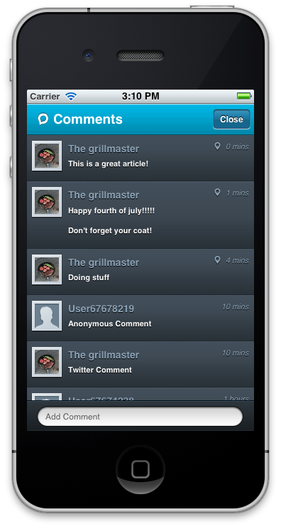
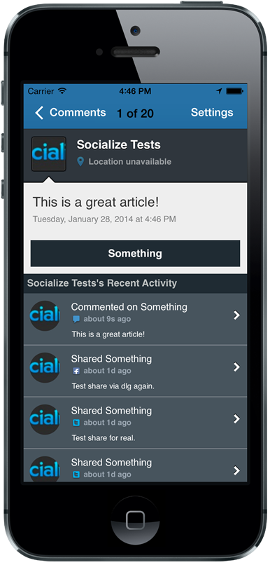
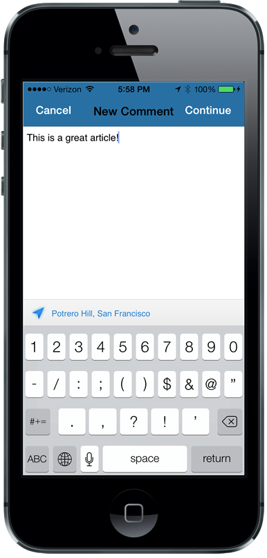
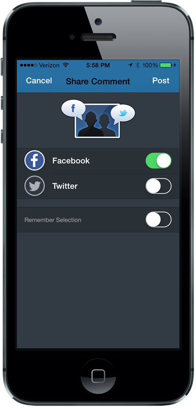

.. include:: feedback_widget.rst

=========================================
Comments
=========================================

UI Elements
----------------------

Comments List
~~~~~~~~~~~~~

The standard Socialize Comment List UI is included with the Socialize Action
Bar however if you wanted to create your own ActionBar or simply want to launch
the Comment List from elsewhere in your app this can simply be done with a few
lines of code

.. literalinclude:: snippets/comments.m
  :start-after: begin-show-comments-list-snippet
  :end-before: end-show-comments-list-snippet

If you need to, you can directly instantiate the comments list and manage its lifecycle on your own.

.. literalinclude:: snippets/comments.m
	:start-after: begin-manual-show-comments-list-snippet
	:end-before: end-manual-show-comments-list-snippet

Comment Composer
~~~~~~~~~~~~~~~~~~~~~~~~~~~

Although the comments list opens a composer, a standalone comment composition
controller is also provided:

.. literalinclude:: snippets/comments.m
  :start-after: begin-show-comment-composer-snippet
  :end-before: end-show-comment-composer-snippet

You can also directly instantiate the comment composer

.. literalinclude:: snippets/comments.m
	:start-after: begin-manual-show-comment-composer-snippet
	:end-before: end-manual-show-comment-composer-snippet

Working with comments
----------------------

Creating Comments, specify networks
~~~~~~~~~~~~~~~~~~~~~~~~~~~~~~~~~~~

To create a comment programmatically you simply call the **addComment** method
on **CommentUtils**

Similar to shares, you can specify how the comment is to be propagated to 3rd party
networks

.. literalinclude:: snippets/comments.m
  :start-after: begin-add-comment-snippet
  :end-before: end-add-comment-snippet

Create comment, prompt for networks
~~~~~~~~~~~~~~~~~~~~~~~~~~~~~~~~~~

If you'd to create a comment and specify text but not networks, you can do so.
You might use this to build your own comment composer but still show the
Socialize network selection dialog.

.. literalinclude:: snippets/comments.m
  :start-after: begin-add-comment-ui-snippet
  :end-before: end-add-comment-ui-snippet

Retrieving Comments
~~~~~~~~~~~~~~~~~~~

You can retrieve existing comments by User, Entity or directly using an ID

List comments by User

.. literalinclude:: snippets/comments.m
  :start-after: begin-list-by-user-snippet
  :end-before: end-list-by-user-snippet
	
List comments by Entity
	
.. literalinclude:: snippets/comments.m
  :start-after: begin-list-by-entity-snippet
  :end-before: end-list-by-entity-snippet

List comments by User on a specific entity

.. literalinclude:: snippets/comments.m
  :start-after: begin-list-by-user-and-entity-snippet
  :end-before: end-list-by-user-and-entity-snippet
	
List comments by ID	
	
.. literalinclude:: snippets/comments.m
  :start-after: begin-list-by-ids-snippet
  :end-before: end-list-by-ids-snippet

List all comments in application
	
.. literalinclude:: snippets/comments.m
  :start-after: begin-list-by-application-snippet
  :end-before: end-list-by-application-snippet

Responding to changes in comment state
~~~~~~~~~~~~~~~~~~~~~~~~~~~~~~~~~~~

You can choose to be notified when comments are created

.. literalinclude:: snippets/comments.m
  :start-after: begin-observe-comments-snippet
  :end-before: end-observe-comments-snippet
