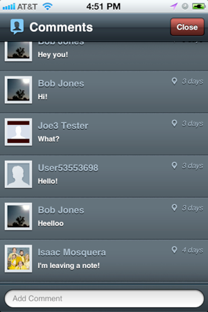
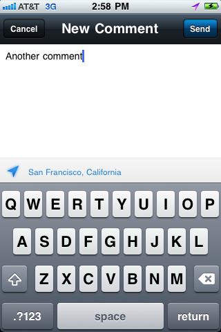
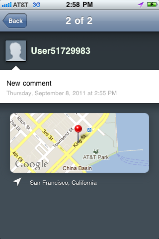

.. include:: feedback_widget.rst

=========================================
Socialize Comments
=========================================

Comment View
----------------------
v0.4.0 of the Socialize SDK introduced the "Comment View" which provides the creation and viewing 
of comments associated with an entity (URL).  

Displaying the Comment View
~~~~~~~~~~~~~~~~~~~~~~~~~~~

When you want to launch the comment view, simply instantiate and present the commentViewController :

.. raw:: html

        
