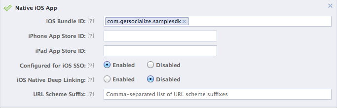
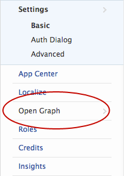
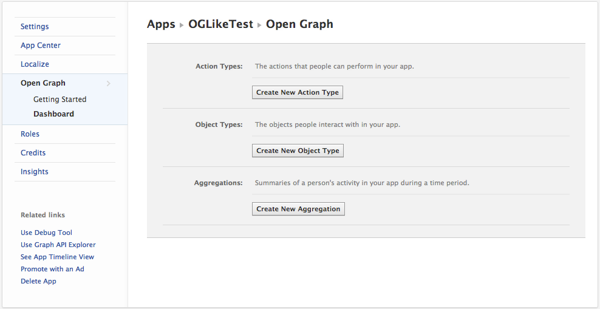
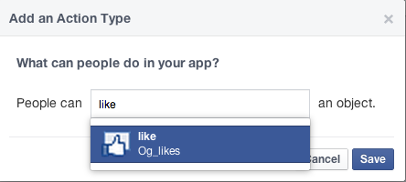
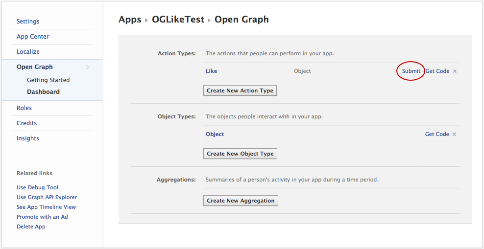
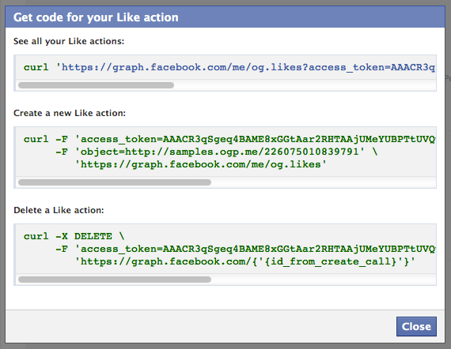
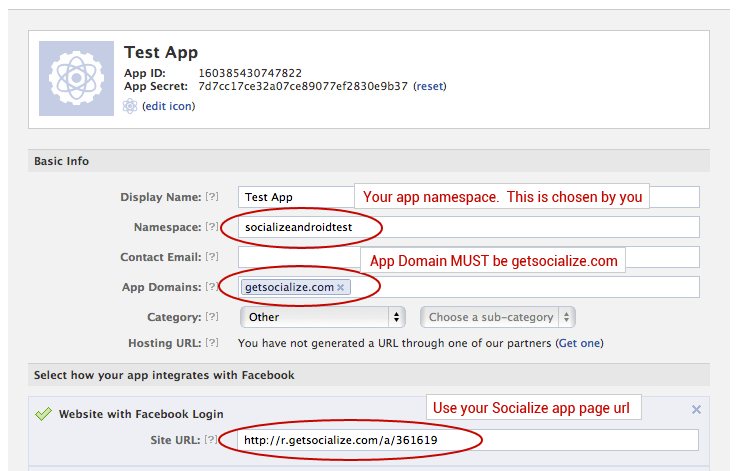
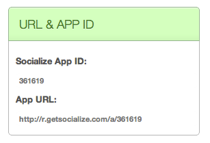

========
Facebook
========

It is strongly recommended that users be able to authenticate with Facebook when using Socialize so as to maximize the exposure, and promotion of your app.

Let Socialize know your Facebook app id.  You can register or find your
Facebook app id here: https://developers.facebook.com/apps

.. literalinclude:: snippets/facebook.m
  :start-after: begin-configure-snippet
  :end-before: end-configure-snippet
  :emphasize-lines: 9

You should set your app up as a native iOS app in its settings. You should enable SSO (single sign-on) and disable deep linking, as in the following screenshot

.. note:: Ensure **iOS Native Deep Linking is DISABLED** otherwise Facebook will bypass the Socialize SmartDownload process.

If your app is not already configured for facebook authentication, then you'll
need to perform two more steps:

First, you must register your app to open with your facebook app id url by
adding a URL Types array to your Application's <MyApp>-Info.plist.  The string
is a lowercase fb followed by your app id. The example app is configured as
below:

.. image:: images/facebook_urltypes.png	

And lastly, you must be sure to call [Socialize handleOpenURL:url] from your
UIApplicationDelegate's application:openURL:sourceApplication: method. Socialize will take
care of handing off the openURL request to the underlying `Facebook iOS SDK
<http://developers.facebook.com/docs/reference/iossdk/authentication/>`_. This
completes the authentication flow.

.. literalinclude:: snippets/facebook.m
  :start-after: begin-openurl-snippet
  :end-before: end-openurl-snippet
  :emphasize-lines: 4

.. note:: Standard Facebook configuration complete. Keep reading for special configuration

Linking with Existing Facebook Credentials
------------------------------------------

If your app already authenticates with Facebook, you can let Socialize
know about the existing session. You can do this with the
**linkToFacebookWithAccessToken:expirationDate:** call.  For more information on
using FBConnect on your own, you can check the official Facebook tutorial at
`Facebook iOS SDK
<http://developers.facebook.com/docs/reference/iossdk/authentication/>`_.

.. literalinclude:: snippets/facebook.m
  :start-after: begin-link-snippet
  :end-before: end-link-snippet

.. note:: The "publish_stream" permission is required for Socialize to function correctly. For maximum
  compatibility you should merge your apps required permissions with the 'requiredPermissions' class method of SZFacebookUtils

Posting to Facebook on your own
------------------------------------------

Should you need to post to Facebook on your own, you can do so by using the
direct Facebook access methods on the utils classes

.. literalinclude:: snippets/facebook.m
  :start-after: begin-post-to-feed-snippet
  :end-before: end-post-to-feed-snippet

See http://developers.facebook.com/docs/reference/api/post/ for more info

Posting Images to Facebook
------------------------------------------

You can also post an image.

.. literalinclude:: snippets/facebook.m
  :start-after: begin-post-image-snippet
  :end-before: end-post-image-snippet

See http://developers.facebook.com/docs/reference/api/photo/ for more info

.. _open_graph:

Using Facebook Open Graph
-------------------------
From v2.3 onwards Socialize supports Facebook "like" Open Graph actions.  This means that when a user executes a "like" on Socialize and elects to 
share this on Facebook it can be posted as an "Open Graph Like" in the user's Facebook Activity stream.

This behavior can be enabled programatically as follows

.. literalinclude:: snippets/facebook.m
  :start-after: begin-enable-og-likes-snippet
  :end-before: end-enable-og-likes-snippet

.. note:: If you are not already familiar with the Facebook Open Graph we recommend reviewing the `Facebook Documentation <https://developers.facebook.com/docs/opengraph/>`_ first

Configuring your Facebook App for Open Graph
~~~~~~~~~~~~~~~~~~~~~~~~~~~~~~~~~~~~~~~~~~~~
Before you are able to utilize Open Graph calls such as "like" you must first follow the Facebook Guidelines for approval of Open Graph actions.

This is detailed on the Facebook website here:

`Open Graph Approval Process <http://developers.facebook.com/docs/opengraph/opengraph-approval/>`_

The following steps apply to seeking approval for the in-built "like" action however the same approach can be followed for all Open Graph Actions.

Adding an Open Graph Action to your App
"""""""""""""""""""""""""""""""""""""""
In your app settings on Facebook, access the Open Graph section:

You will be presented with the default configuration screen for Open Graph.  Click the **Create New Action Type** button and select the action to be added

You will then be presented with a dialog in which your action can be selected.  Choose an appropriate action and click **Submit**

Once your action has been added you are ready to submit it for approval.  Click the **Submit** link.

At this point you may encounter some validation errors.  The most common of which are:

.. image:: images/fb_og_error1.png

The **Publish Action** requirement is most easily satisfied by simply executing the same *curl* command provided by Facebook.

Click on the **Get Code** link next to your action and run the *curl* command you are provided from your terminal (command line) interface

The final step in the approval process requires you to clarify with Facebook the exact purpose for your OG action.  

.. image:: images/fb_og_error2.png

Socialize has prepared a standard response for you to use in this situation.  If you are using the Socialize UI features "out-of-the-box" (that is, without modification) then you 
can simply refer to the content we have provided for you at:  

http://blog.getsocialize.com/facebook-open-graph-review

If you have implemented your own UI and/or are calling the Socialize SDK directly through any other means we recommend you follow the guidelines established by Facebook for the approval of 
Open Graph actions.

https://developers.facebook.com/docs/opengraph/checklist/

Using In Built Open Graph Actions
~~~~~~~~~~~~~~~~~~~~~~~~~~~~~~~~~

The in built OG actions provided by Facebook **require approval by Facebook** and there is a limited set of actions available and a corresponding limited set of object types.

The actions supported and the corresponding object types are as follows

+------------+-------------------+---------------+---------------+
| Action     | Path              | Object Types  | Parameter     |
+============+===================+===============+===============+
| like       | me/og.likes       | object        | object        |
+------------+-------------------+---------------+---------------+
| follow     | me/og.follows     | profile       | profile       |
+------------+-------------------+---------------+---------------+
| publish    | me/news.publishes | article       | article       |
+------------+-------------------+---------------+---------------+
| read       | me/news.reads     | article       | article       |
+------------+-------------------+---------------+---------------+
| watch      | me/video.watches  | video.movie   | movie         |
+------------+-------------------+---------------+---------------+
|            |                   | video.episode | movie         |
+------------+-------------------+---------------+---------------+
|            |                   | video.tv_show | movie         |
+------------+-------------------+---------------+---------------+
|            |                   | video.other   | movie         |
+------------+-------------------+---------------+---------------+

The Object Types specified in the Open Graph call **MUST** correspond to a valid *og:type* meta element in the HTML page that represents the object.

For example::

	<meta property="og:type" content="video.movie" /> 

Fortunately Socialize will **automatically generate OG tags** on your entity page, but you must specify the correct type on the entity object itself.

.. literalinclude:: snippets/facebook.m
	:start-after: begin-set-entity-type-snippet
	:end-before: end-set-entity-type-snippet
	
Once you have setup your Entity with the correct type you can force an Open Graph post by changing the PostData in the SocialNetworkListener.  
Here's a complete example

.. literalinclude:: ../../../../demo/src/com/socialize/demo/snippets/FacebookSnippets.java
	:start-after: begin-snippet-13
	:end-before: end-snippet-13	
	
The corresponding entity page on Socialize will automatically populate the required OG meta tags::

	<meta property="og:title" content="My Entity Name" /> 
	<meta property="og:description" content="...parsed from your URL..." /> 
	<meta property="og:image" content="...parsed from your URL..." />
	<meta property="og:type" content="video.movie" />
	<meta property="og:url" content="...the URL of this page..." />
	
.. raw:: html
   :file: snippets/open_graph_notice.html

If you don't have an actual URL for your entity you can setup the correct description, image etc by changing the meta data on your entity.

Refer to :ref:`entity_no_url` for more details on customizing the entity page.

Using Custom Open Graph Actions
"""""""""""""""""""""""""""""""
In addition to using the built-in Open Graph actions, you can also define your own.

For example an app that reviews restaurants may want to post the fact that a user "ate" a "meal" rather than simply saying a user "shared" a "link".

There is however a fairly lengthy setup process to correctly configure your application to handle custom OG actions.

We recommend reviewing the `Open Graph Tutorial <http://developers.facebook.com/docs/opengraph/tutorial/>`_ to understand how to configure your app for custom Open Graph actions.

Configuring Custom Open Graph Actions
+++++++++++++++++++++++++++++++++++++
Facebook Open Graph implements several security systems to ensure that owners of content are verified.  One such security measure ensures that websites housing information about custom OG types are registered 
against the Facebook App to guarantee that 3rd party users cannot fraudulently represent custom types on external pages.

If you want to utilize custom open graph actions in your Socialize enabled app you must first configure your Facebook application to expect posts that refer to websites hosted by Socialize.

This consists of 3 simple steps:

#. Obtain your Socialize App Url from your dashboard at www.getsocialize.com
#. Nominate the Socialize App Url as your "Site URL" on Facebook
#. Add the **getsocialize.com** domain to your list of App Domains on Facebook.

You can obtain your Socialize App Url from the "SmartDownloads" section accessed from your dashboard at www.getsocialize.com

Once you have configured your application to accept custom Open Graph actions you can post these actions to Facebook by changing the PostData in the SocialNetworkListener.  

.. literalinclude:: ../../../../demo/src/com/socialize/demo/snippets/FacebookSnippets.java
	:start-after: begin-snippet-12
	:end-before: end-snippet-12
