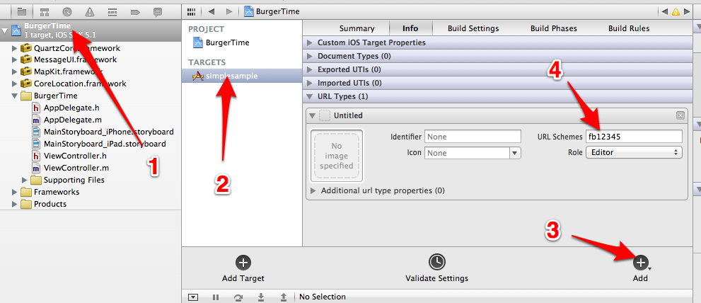

========
Facebook
========

It is strongly recommended that users be able to authenticate with Facebook when using Socialize so as to maximize the exposure, and promotion of your app.

Let Socialize know your Facebook app id.  You can register or find your
Facebook app id here: https://developers.facebook.com/apps

.. literalinclude:: snippets/facebook.m
  :start-after: begin-configure-snippet
  :end-before: end-configure-snippet
  :emphasize-lines: 9

If your app is not already configured for facebook authentication, then you'll
need to perform two more steps:

First, you must register your app to open with your facebook app id url by
adding a URL Types array to your Application's <MyApp>-Info.plist.  The string
is a lowercase fb followed by your app id. The example app is configured as
below:

And lastly, you must be sure to call [Socialize handleOpenURL:url] from your
UIApplicationDelegate's application:openURL:sourceApplication: method. Socialize will take
care of handing off the openURL request to the underlying `Facebook iOS SDK
<http://developers.facebook.com/docs/reference/iossdk/authentication/>`_. This
completes the authentication flow.

.. literalinclude:: snippets/facebook.m
  :start-after: begin-openurl-snippet
  :end-before: end-openurl-snippet
  :emphasize-lines: 4

.. note:: Standard Facebook configuration complete. Keep reading for special configuration

Linking with Existing Facebook Credentials
------------------------------------------

If your app already authenticates with Facebook, you can let Socialize
know about the existing session. You can do this with the
**linkToFacebookWithAccessToken:expirationDate:** call.  For more information on
using FBConnect on your own, you can check the official Facebook tutorial at
`Facebook iOS SDK
<http://developers.facebook.com/docs/reference/iossdk/authentication/>`_.

.. literalinclude:: snippets/facebook.m
  :start-after: begin-link-snippet
  :end-before: end-link-snippet

