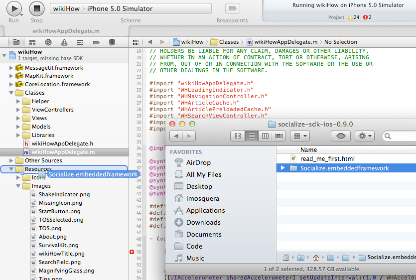
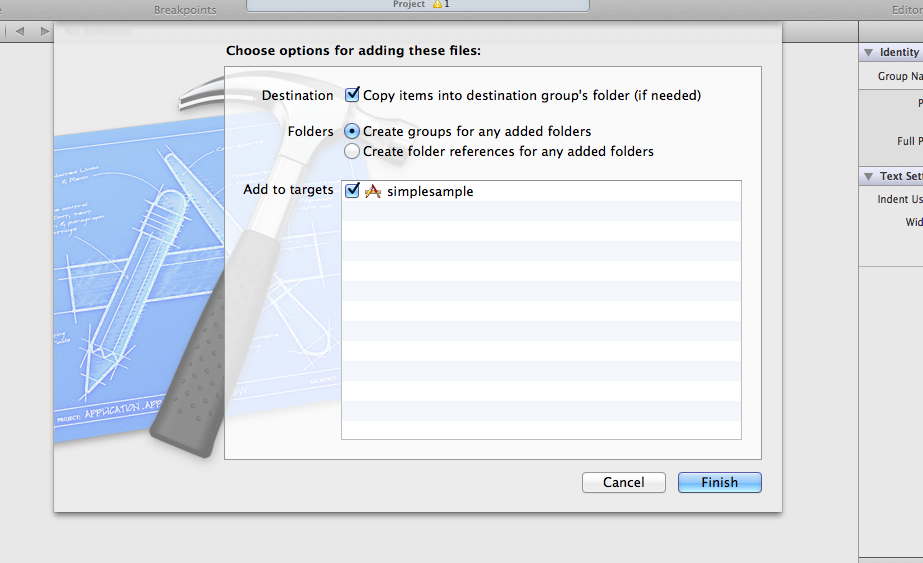
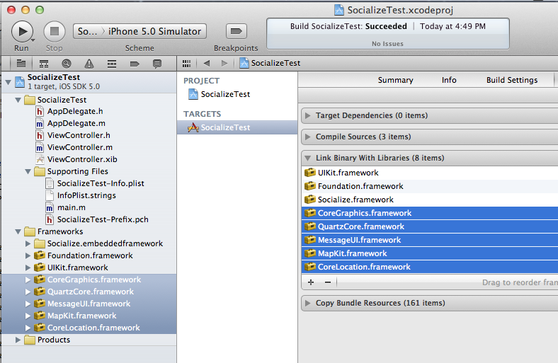
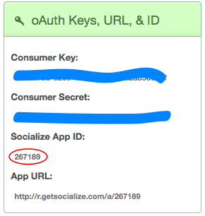
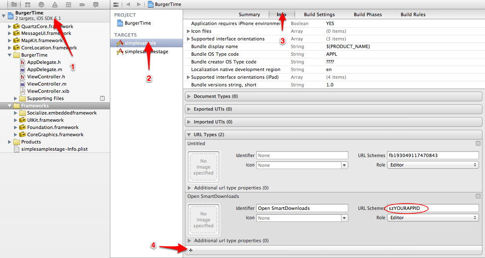
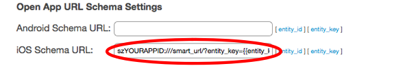

.. include:: feedback_widget.rst

=====================
Getting Started Guide
=====================

.. contents:: Table of contents
 

Introduction
------------
The Socialize SDK provides a simple set of classes and methods built upon the `Socialize REST API <http://www.getsocialize.com/docs/v1/>`_

App developers can elect to use either the pre-defined user interface controls provided in the Socialize UI 
framework, or "roll their own" using direct SDK calls.

All calls to the Socialize SDK are *asynchronous*, meaning that your application will not "block" while 
waiting for a response from the Socialize server.

You are notified of the outcome of calls to the Socialize service via a *SocializeServiceDelegate* 
passed into each call to the Socialize SDK.

The main class through which you will be interacting would be Socialize. 

.. note:: * iOS 6.1 is the minimum version supported by this SDK
 
Installing the SDK
------------------

If you are upgrading from a previous release, check out the `Upgrading Guide`_.
    .. _Upgrading Guide: upgrading.html

Installing with CocoaPods
-------------------------

As of release 3.0.1, Socialize iOS SDK can be installed with CocoaPods.

CocoaPods is an easy, elegant way to manage library dependencies in iOS. No need to manually import frameworks or deal with compiler flags. After a one-time installation of RubyGems (CocoaPods is Ruby-based), a single command-line operation is all that's needed to install or upgrade Socialize. For more information on CocoaPods, check out the `CocoaPods homepage`_.

  .. _CocoaPods homepage: http://cocoapods.org/

Step 1: Install RubyGems & CocoaPods (One-Time Operation)
~~~~~~~~~~~~~~~~~~~~~~~~~~~~~~~~~~~~~~~~~~~~~~~~~~~~~~~~~

- Current Macs come preinstalled with Ruby 1.8.7 or higher. For the purposes of CocoaPods, **this is the correct version.** However, you may still need to install RubyGems as directed from the `installation page`_.
 

  .. _installation page: https://rubygems.org/pages/download
 

- Verify that you have both Ruby and RubyGems installed by entering the following in the command line:

::

            $ ruby -v
            ruby 1.8.7 (2012-02-08 patchlevel 358) [universal-darwin12.0]
            $ gem -v
            2.1.5
 
- Install CocoaPods by entering the following in the command line:

::

           $ sudo gem install cocoapods
           $ pod setup
 
 
.. note:: Installing RubyGems and/or CocoaPods can take up to a minute, and may appear unresponsive for brief periods during install.

Step 2: Initialize the Socialize Pod Repository (One-Time Operation)
~~~~~~~~~~~~~~~~~~~~~~~~~~~~~~~~~~~~~~~~~~~~~~~~~~~~~~~~~~~~~~~~~~~~

- The Socialize SDK uses a number of customized forked frameworks. To prevent confusion with the public versions of these frameworks, these have been renamed and added to their own Spec repository. To install the Socialize Spec repository, enter the following in the command-line:

::

           $ pod repo add SocializeCocoaPods https://github.com/socialize/SocializeCocoaPods.git
 

Step 3: Install Socialize as a CocoaPod
~~~~~~~~~~~~~~~~~~~~~~~~~~~~~~~~~~~~~~~

- In the root directory of your project, create a Podfile or add to an existing Podfile. This file (named "Podfile" with no extension) specifies which CocoaPods will be included in your project. **Your Podfile should contain the following:**

::

            platform :ios, '6.1'
            inhibit_all_warnings!

            pod 'Socialize', :podspec => 'https://raw.github.com/socialize/socialize-sdk-ios/master/Socialize.podspec'
 

.. note:: If you already use an Xcode workspace to manage your project files, you will need to customize your Podfile to include CocoaPods for each Xcode project and app target. If you are already using Pods also used by the Socialize SDK, you may need to ensure the versions are consistent. See this `CocoaPods help page`_ for more information.
 
  .. _CocoaPods help page: https://github.com/CocoaPods/CocoaPods/issues/738

- Once complete, your Podfile should appear in this location in your project directory:

  .. image:: images/podfile_in_directory.png
            :width: 994
            :height: 235
 

- In the command line at the root directory of your project, enter the following:

::

            $ pod install

- After the Socialize CocoaPod is created in your project, **you must use the Xcode workspace (YourProject.xcworkspace) to use the CocoaPod.** All your project settings should still be available to you from the workspace. **DO NOT open the .xcodeproj directly.**

**Once installation via CocoaPods is complete, go to "Configuring Socialize," below.**

Manual Installation via Framework
---------------------------------

If you prefer not to use CocoaPods, the SDK can still be installed as before:

Step 1: Add the Socialize Framework to Your Project
~~~~~~~~~~~~~~~~~~~~~~~~~~~~~~~~~~~~~~~~~~~~~~~~~~~~~~~~~~~~~~~

- **Download and unzip the lastest iOS SDK release from the website.**  
  You can find it here: http://www.getsocialize.com/sdk/
- **Install the embedded static framework to your application.**

  To do this just drag and drop Socialize.embeddedframework folder from the
  package to your framework section in your project.

.. note:: Be sure to drag the outlying .embeddedframework folder, not just the framework. The .embeddedframework directory contains both the Socialize framework and the Socialize resources.
  If you just add the framework, you will be missing important Socialize images and configuration files.

- When prompted, check "Copy items into destination group's folder (if needed)" and click finish

.. note:: Be sure the 'Create groups for any added folders' radio button is selected during the above step. If you select
  'Create folder references for any added folders', a blue folder reference will be added to the project
  and socialize will not be able to locate its resources.

Step 2: Add Required Frameworks to Your Project
~~~~~~~~~~~~~~~~~~~~~~~~~~~~~~~~~~~~~~~~~~~~~~~~~~~~~~~~~

- Add the following frameworks to your application target:

::

           CoreLocation.framework
           MapKit.framework
           MessageUI.framework
           QuartzCore.framework
           CoreGraphics.framework
           AdSupport.framework

Step 3: Set Project Linker and Code Generation Flags
~~~~~~~~~~~~~~~~~~~~~~~~~~~~~~~~~~~~~~~~~~~~~

- Add **-ObjC** and **-all_load** flag to the Other Linker Flags in the build settings of your application target. *Please use the flag exactly as it is—the most common mistake here tends to be misspelling or incorrect capitalization.*

	.. image:: images/image00.png
   			:width: 700
   			:height: 410

- For each of your application targets (or, if preferred, for the entire project), set the Debug setting of "Generate Test Coverage Files" and "Instrument Program Flow" in "Apple LLVM 5.0 - Code Generation" to "Yes":

  .. image:: images/compiler_settings_289.png
        :width: 529
        :height: 278

- For older versions of Xcode (4.3 and below), if your app is not arc-enabled, you MUST also add **-fobjc-arc** to the Other Linker flags.

If you need more detail configuring the SDK in your app please see our `Getting Started Video`_.

    .. _Getting Started Video: http://vimeo.com/31403067

If you're having problems please let us know by clicking on the 'Feedback' tab on the right side of the page.   We're here to help.

You can also search or post on our `support forums`_

  .. _support forums: http://support.getsocialize.com

**Once installation is complete, go to "Configuring Socialize," below.**

Configuring Socialize (Post-Installation)
-----------------------------------------

Step 1: Import Header and Set up your Socialize Keys
~~~~~~~~~~~~~~~~~~~~~~~~~~~~~~~~~~~~~~~~~~~~~~~~~~~~~~~~~~~~~~~~~~~~~~~~~~~~~~~~

To utilize the iOS SDK and views into your app, we need to import the Socialize.h header and let the library know your app key and secret.  Your application key and secret can be found 
at `http://www.getsocialize.com/apps <http://www.getsocialize.com/apps>`_.  Click your app and look for the 'oAuth Keys' module on the right-hand column.

.. note:: Make sure to import the Socialize header in the code snippet below

.. literalinclude:: snippets/configure_keys.m
  :start-after: begin-snippet
  :end-before: end-snippet

Step 2: Define an Entity Loader
~~~~~~~~~~~~~~~~~~~~~~~~~~~~~~~~~~~~~~~~~~~~~~~~~~~~~~~~~~~~~~~~~~~~~~~~

Defining an Entity Loader allows Socialize's UI objects to link back to your
application's objects. The entity loader block is called from certain builtin
Socialize UI Controls (e.g. Comment Details) when they need to show information
about an entity. It is also used when directing users back into your app.

Typically, you should have your own view controller for showing detail on an entity in your
app. You should push a view controller onto the stack.

If you'd just like to see notifications in action, you can use the bundled entity example entity
loader called **SampleEntityLoader**. This class is not intended for use in a production app.

Copy the lines below to add an entity loader 

.. literalinclude:: snippets/configure_notifications.m
  :start-after: begin-entity-loader-snippet
  :end-before: end-entity-loader-snippet
  :emphasize-lines: 14-25

.. image:: images/entity_loader.png

Step 3: Add Socialize URL Scheme Entry
~~~~~~~~~~~~~~~~~~~~~~~~~~~~~~~~~~~~~~~~~~~~~~~~~

In order to allow Socialize to direct web users back into your app, you should add
a custom URL scheme to your apps settings. The URL Scheme is based on your
Socialize app id, which can be found on the right side of your apps dashboard
at http://getsocialize.com/apps/ under the heading "*oAuth Keys, URL, & ID*". 

Once you have the appid, you should add it to your apps 'URL Types' section. The
scheme is **szYOURAPPID**. That is, a lower case sz followed immediately by your numeric
Socialize app id from the dashboard, defined as below:

You currently must also take the final step of enabling SmartDownloads in the
web dashboard.  Select your app from the list of apps at
http://getsocialize.com/apps/, select 'SmartDownloads' on the right, then
Scroll to the bottom until you see the 'iOS Schema URL' field. Enter the
following:
**szYOURAPPID:///smart_url/?entity_key={{entity_key}}&entity_id={{entity_id}}**

Step 4: Include Socialize in your App!
~~~~~~~~~~~~~~~~~~~~~~~~~~~~~~~~~~~~~~~~~~~~~~~~~

Now that you have your environment all setup, it’s time to include Socialize.

The core component of the Socialize SDK is the “Action Bar”

.. image:: images/action_bar_solo.png	

This is a general purpose toolbar that sits at the bottom of your app and provides a central "one-stop-shop" of social features for your users.  Remember if you want to use 
components individually please go see the SDK user guide.

.. note:: Each Action Bar instance in your app is bound to an Entity. An Entity is simply an item of content in your app. Each Socialize action (comment, share, like etc.) is associated with an Entity.
An entity can be any item of content like a website, photo or person but MUST be given a unique key within your app.
It is not necessary to explicitly create an Entity object when rendering the Action bar as this will be done for you, however entities can be created manually.

Using the SocializeActionBar is very simple. Instantiate a SocializeActionBar controller and add the view to your view controller.  

In your View controller's header file place the following code:

.. literalinclude:: snippets/create_action_bar.h

.. literalinclude:: snippets/create_action_bar.m
  :start-after: begin-simple-create-snippet
  :end-before: end-simple-create-snippet

For more info on configuring the action bar, see the `Action Bar Section <action_bar.html>`_.

By now you should be able to see the Socialize Action Bar.  If you need any help please visit us at http://support.getsocialize.com

Optional: Configure Your App for Facebook
~~~~~~~~~~~~~~~~~~~~~~~~~~~~~~~~~~~~~~~~~~~~~~~~~~~~~~~~~~~~~~~~~~~~~~~~~~~~~
See the `Facebook section <facebook.html>`_.

Optional: Configure Your App for Twitter
~~~~~~~~~~~~~~~~~~~~~~~~~~~~~~~~~~~~~~~~~~~~~~~~~~~~~~~~~~~~~~~~~~~~~~~~~~~~~
See the `Twitter section <twitter.html>`_.
 
Next Steps
-----------------------------------------------------------------------------------------
Run the app in your simulator or device, have fun with the action bar, add comments, likes and shares. Then you can visit the app dashboard on the Socialize website to see new user actions show up in the analytics charts.  You can also enable additional features like Push Notifications.

http://www.getsocialize.com/apps/
