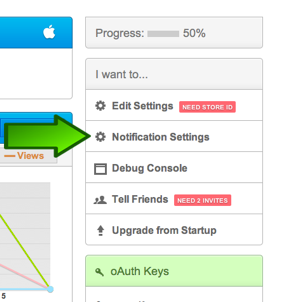

.. include:: feedback_widget.rst

=========================================
Enabling Push Notifications
=========================================

Introduction
----------------------------------------------------------------------

In v1.3 of Socialize we introduced push notifications. This provides your app with a simple and effective way to bring users back into the “viral loop” of the app.

.. image:: images/apns_screenshot.png

LiveAlerts in Comment Threads
~~~~~~~~~~~~~~~~~~~~~~~~~~~~~~~~~~~~~~~~~~~~~~~~~~~~~~~~~~~~~~~~~~~~~~~~~~~~~~~~~~~~~~~~~~~~~~~~~
when a user posts a comment they can elect to subscribe to updates for that topic.

When another user then posts a comment, the original user will receive a push notification to their device bringing them back into the app.

Step 1: Enable Notifications on http://www.getsocialize.com
----------------------------------------------------------------------------------------------
For Push Notifications to work they must be enabled on a compatible plan at http://getsocialize.com/apps

Select your app and click “Notification Settings”

.. image:: images/notification_web_settings.png

Then turn on enabled:

.. image:: images/notification_web_switch.png

Step 2: Configuring Your Apple App ID
----------------------------------------------------------------------

To enable APNS for your application you'll first have to configure your App ID in `Apple's developer portal <https://developer.apple.com/ios/manage/bundles/index.action>`.   
You can configure your App ID here:
https://developer.apple.com/ios/manage/bundles/index.action

.. image:: images/appid_listing.png

Step 3: Keys/Certificates for your App ID for APNS
----------------------------------------------------------------------

To start the process click the 'configure' button on the right hand side and follow the directions 
given to you by Apple **very carefully**.  Once you've completed the steps make sure you download the certificate and double-click on the certificate. 
This should result in the 'Keychain Access' application opening. 

.. note:: You don’t have to use your primary Keychain key as the identifier, nor does it have to connect to your developer account.   You can make a new keychain in Keychain Access, and use that to handle the Certificate Signing Request. This can be especially useful if you need to share this between multiple developers.

.. image:: images/add_certificates.png

Step 3: Exporting your .p12 (key/certificate pair) from the Keychain Access tool.
------------------------------------------------------------------------------------
After you've downloaded and double-clicked the certificate it should automatically open the 'Keychain Access' tool. Then find they 'My Certificates' category on the left hand side of the 
'Keychain Access' tool.  Right click on the 'Apple Production iOS Push Services' and export the key/certificate pair in the p12 (Personal Information Exchange) format.  
Save this file without a password and upload it to our developer portal.

.. image:: images/export_p12.png

Step 4: Uploading your .p12 to the Socialize Developer Portal
------------------------------------------------------------------------------------

To upload you'll need to get to the application dashboard: http://www.getsocialize.com/apps/ and select the application you want to configure.  If you've added a 
password to your p12 in the previous step make sure to put that in.

Step 5: Configuring Socialize in Your App
------------------------------------------------------------------------------------

To configure your app you'll need to register for notifications and handle the notification response.

Register for Notifications
~~~~~~~~~~~~~~~~~~~~~~~~~~~~~~~~~~~~~~~~~~~~~~~~~~~~~~~~~~~~~~~~~~~~~~~~
To configure Socialize inside the app, the minimum you'll need to do is register for notifications.  Run the application, and see that you get the push notification request pop-up. 
If you do not get it, you might be using the wrong provisioning profile.

.. raw:: html

     

Handle Notifications
~~~~~~~~~~~~~~~~~~~~~~~~~~~~~~~~~~~~~~~~~~~~~~~~~~~~~~~~~~~~~~~~~~~~~~~~
For notifications you'll have to handle notifications.  Our method call knows whether the notification was meant for the Socialize SDK and if not, it allows you to handle the 
application specific notification.

.. raw:: html

    
