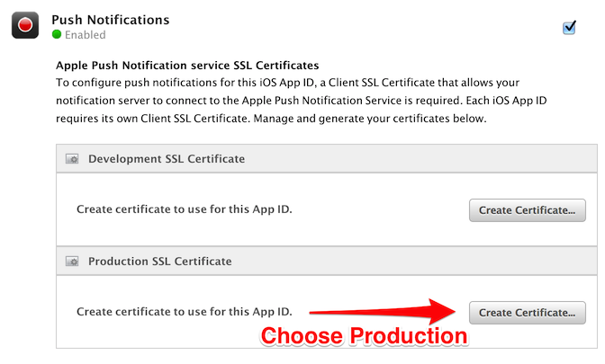

.. include:: feedback_widget.rst

=========================================
Enabling SmartAlerts™ Notifications
=========================================

Introduction
----------------------------------------------------------------------

In v1.3 of Socialize we introduced push notifications. This provides your app with a simple and effective way to bring users back into the “viral loop” of the app.

.. image:: images/apns_screenshot.png

SmartAlerts™ in Comment Threads
~~~~~~~~~~~~~~~~~~~~~~~~~~~~~~~~~~~~~~~~~~~~~~~~~~~~~~~~~~~~~~~~~~~~~~~~~~~~~~~~~~~~~~~~~~~~~~~~~
when a user posts a comment they can elect to subscribe to updates for that topic.

When another user then posts a comment, the original user will receive a push notification to their device bringing them back into the app.

Step 1: Setup SmartAlerts™ on the App Dashboard
--------------------------------------------------------------------------------
for Push Notifications to work they must be enabled on a compatible plan at http://getsocialize.com/apps

Select your app and click “SmartAlerts Settings”

.. image:: images/notification_web_settings.png

Then turn on enabled:

.. image:: images/notification_web_switch.png

Step 2: Configuring Your Apple App ID
--------------------------------------------------------------------------------

Find your App ID in the `Apple's developer portal <https://developer.apple.com/ios/manage/bundles/index.action>`_ here: https://developer.apple.com/ios/manage/bundles/index.action> . Then click 'Configure' on the right-hand side.

.. image:: images/appid_listing.png

Make sure "Enable for Apple Push Notification service" is checked.

Step 3: Keys/Certificates for your App ID for APNS
--------------------------------------------------------------------------------

* Click the 'configure' button for your desired certificate ('Production Push
  SSL Certificate' or 'Development Push SSL Certificate') on the right hand
  side.  Follow the directions given to you by Apple **very carefully**.  

.. note:: 

    * You don’t have to use your primary Keychain key as the identifier, nor does it have to connect to your developer account.   You can make a new keychain in Keychain Access, and use that to handle the Certificate Signing Request. This can be especially useful if you need to share this between multiple developers.

 
* Open the certificate after completing the steps and downloading the certificate(.cer) by double clicking the file.  This should result in the 'Keychain Access' application opening.  

* **Re-create your distribution provisioning profile, download and re-install the profile**.

.. note:: 

    It is important to note that just creating or updating your Apple Push Notification Service certificate will not update your provisioning profile.  Therefore make sure to re-create your distribution
    provisioning profile for your changes to take effect.
 
Step 4: Exporting your .p12 (key/certificate pair) from the Keychain Access tool.
----------------------------------------------------------------------------------------

Double-clicking the certificate(.cer) should automatically open the 'Keychain Access' tool. 

* Find the 'My Certificates' category on the left hand side of the 'Keychain Access' tool. 

* Right-click on the 'Apple Production iOS Push Services' and export the key/certificate pair in the p12 (Personal Information Exchange) format.  

* Save this file without a password to your desktop.
  

.. image:: images/export_p12.png

Step 5: Uploading your .p12 to the Socialize Developer Portal
--------------------------------------------------------------------------------

* Go to your SmartAlert's setup dashboard and upload the p12 from the previous step.  You can find your application dashboard here: http://www.getsocialize.com/apps

If you've added a password to your p12 make sure to put that in.

.. image:: images/notification_p12_upload.png

.. note:: Only one p12 can be configured at a time for any given Socialize app. If you need to test
  both production and development push tokens, it is recommended that you create separate
  Socialize apps (one for Development, and one for Production).

Step 6: Configuring Notifications in Your App
--------------------------------------------------------------------------------
To configure your app you'll need to register for notifications, handle the notification response and define an entity loader so we display users your content.

Register for Notifications
~~~~~~~~~~~~~~~~~~~~~~~~~~~~~~~~~~~~~~~~~~~~
Add the following line to your application delegate:

.. literalinclude:: snippets/configure_notifications.m
  :start-after: begin-snippet
  :end-before: end-snippet

Register the Device Token
~~~~~~~~~~~~~~~~~~~~~~~~~~~~~~~~~~~~~~~~~~~~~~~~~~~~~~~~~~~~~~~~~~~~~~~~
To register your app's device token add the following lines to your application's delegate

.. literalinclude:: snippets/configure_notifications.m
  :start-after: begin-register-snippet
  :end-before: end-register-snippet

Handle Notifications
~~~~~~~~~~~~~~~~~~~~~~~~~~~~~~~~~~~~~~~~~~~~~~~~~~~~~~~~~~~~~~~~~~~~~~~

* Add the lines below to allow Socialize to handle the notification.

.. literalinclude:: snippets/configure_notifications.m
  :start-after: begin-handle-snippet
  :end-before: end-handle-snippet
  :emphasize-lines: 1-22,24-28,38-41

.. note::

    * Socialize will not currently do any UI display for notifications received while in the foreground. If you need special behavior for foreground notifications, you should add it on your own. See the bottom else block in handleNotification: above.
    * Our method call will let you know if the notification was a Socialize notification. This allows you to use the logic below to also handle notifications of your own, if you need to.
 
Defining an Entity Loader
~~~~~~~~~~~~~~~~~~~~~~~~~~~~~~~~~~~~~~~~~~~~~~~~~~~~~~~~~~~~~~~~~~~~~~~~
For Smart Alerts to work correctly, you must define an entity loader.

Defining an Entity Loader allows Socialize's UI objects to link back to your
application's objects. The entity loader block is called from certain builtin
Socialize UI Controls when it needs to show information about an entity. It is currently
shown in the comment details activity listing table view.

Typically, you should have your own view controller for showing detail on an entity in your
app. You should push a view controller onto the stack.

If you'd just like to see notifications in action, you can use the bundled entity example entity
loader called **SampleEntityLoader**. This class is not intended for use in a production app.

Copy the lines below to add an entity loader 

.. literalinclude:: snippets/configure_notifications.m
  :start-after: begin-entity-loader-snippet
  :end-before: end-entity-loader-snippet
  :emphasize-lines: 14-18

.. image:: images/entity_loader.png

For some applications, it might happen that an entities are not always
available. Socialize provides the ability to selectively disable loading for a
given entity. Should you find you need this, you can do this by defining a "Can
Load Entity" block, as follows

.. literalinclude:: snippets/configure_notifications.m
  :start-after: begin-can-load-entity-snippet
  :end-before: end-can-load-entity-snippet

Testing SmartAlerts™ 
-----------------------------------------------------------------------------------

In order to test that SmartAlerts™ are working correctly you'll want to first to get your app compiled and installed on a physical device and working 
on the simulator as well.  

#. Open apps on both the simulator and the physical device.
#. From the physical device leave a comment on an entity.  Make sure you to subscribe to entity when you leave a comment.  You should now be subscribed to the entity and will receive notifications when someone else leaves a comment.
#. On the simulator add a comment to the same the entity from which you did on the physical device.
#. Notifications are sent out asynchronously in a queue.  It may take 2-3 minutes to receive your notification.

.. image:: images/subscribe_button.png

.. note:: The subscribe button will only show on an actual device. If you do not see the button on the device, please refer to the Troubleshooting section below.

Sending Targeted SmartAlerts™
-----------------------------------------------------------------------------------
If you would like to send a target alert your users, you can do so. Simply
click "Send SmartAlert" from the developer dashboard. You can direct the user
to either a specific entity or a URL of your choosing. Directing to an entity
will trigger your entity loader. Directing to a URL will send the user to a web
view to a URL of your choosing. You can either target all of your users or specify
a comma-separated list of user ids.

.. image:: images/send_targeted_smartalert.png

.. note:: Socialize v1.6 or later is required to receive targeted SmartAlerts

Subscribing to Entity Subscribers (Without Comments)
-----------------------------------------------------------------------------------
It's possible to subscribe your users to specific entities, and send alerts only to users
who have subscribed to these entities. The builtin UI controllers do not expose this
functionality, but if you wish, you can handle the subscription on your own.

#. Open the Socialize web dashboard for your app at getsocialize.com / "My Apps"
#. Select the "Entities" tab
#. Navigate to or search for your entity by key or id
#. Click 'Send SmartAlert' underneath 'I want to...' on the right
#. Fill out the alert content
#. Check 'Send only to explicitly subscribed users'

.. image:: images/send_subscriber_smartalert.png

.. note:: Socialize v2.2.1 or later is required to receive subscriber-only smart alerts

Overriding the Notification Display Process
-------------------------------------------

Because of the asynchronous nature of notifications, Socialize displays the
associated view controllers is the main window of the application by default.
If you'd like to override this behavior, you can do so by specifying a global
display object. See :ref:`global_display` for more info.

Programmatically Dismissing Notification Popups
----------------------------------------

You might find that you'd like to dismiss all Socialize notifications outside of the normal
user flow. As a convenience, you can dismiss all Socialize notification popups
programatically by posting a SocializeShouldDismissAllNotificationControllersNotification.

.. literalinclude:: snippets/configure_notifications.m
  :start-after: begin-dismiss-notifications-snippet
  :end-before: end-dismiss-notifications-snippet

Troubleshooting Notifications
----------------------------------------

If you are not receiving notifications, there are some simple ways to
troubleshoot problems.  We also have a vibrant developer community and support
here: http://support.getsocialize.com support who can help.

Additionally, here some common errors you might encounter:

I Don't See the Notifications Button
~~~~~~~~~~~~~~~~~~~~~~~~~~~~~~~~~~~~

The notifications button will only appear if a valid push token has been
registered with Socialize using [Socialize registerDeviceToken:]. This means
the buttons will never show on the iOS simulator.

If you do not see the buttons on the actual device, you might try making sure there
are no errors with registration process, as described in the next section.

Logging Errors from Notifications Registrations
~~~~~~~~~~~~~~~~~~~~~~~~~~~~~~~~~~~~~~~~~~~~~~~~~~~~~~~~

You can implement the notifications delegate method which callbacks if any error occurs during registration.  This should log
the value of the error to your console.

.. literalinclude:: snippets/configure_notifications.m
  :start-after: begin-register-fail-snippet
  :end-before: end-register-fail-snippet

I Keep Getting the Error "no valid 'aps-environment' entitlement string found for application"
~~~~~~~~~~~~~~~~~~~~~~~~~~~~~~~~~~~~~~~~~~~~~~~~~~~~~~~~~~~~~~~~~~~~~~~~~~~~~~~~~~~~~~~~~~~~~~~~~

This typically means you didn't re-create and download the provisioning profile after you enabled pushed notifications.  
You can re-create your distribution profile here: https://developer.apple.com/ios/manage/provisioningprofiles/viewDistributionProfiles.action.  You'll also want to remove any 
other versions of provisioning file which exist on your phone.

Everything looks ok, but I am still not receiving notifications
~~~~~~~~~~~~~~~~~~~~~~~~~~~~~~~~~~~~~~~~~~~~~~~~~~~~~~~~~

You can try sending a push directly to your device. You can open the device logs from Xcode
by attaching your device, selecting Window -> Organizer, choosing your device, and selecting
"Console". The message is 

.. raw:: html

  <pre>Mar 28 12:16:57 AppName[3354] <Warning>: Socialize: device token FFFFFFFFFFFFFFFFFFFFFFFFFFFFFFFFFFFFFFFFFFFFFFFFFFFFFFFFFFFFFFFF successfully registered with server</pre>

You can then send a notification from the web interface, in the "View Debugger" section of the
web interface.

.. image:: images/send_to_device.png

Please go to support.getsocialize.com for additional support.
