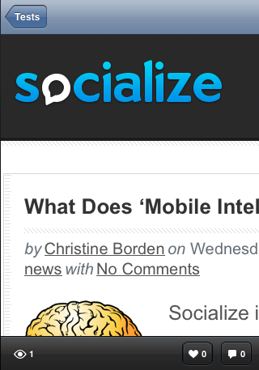

.. include:: feedback_widget.rst

=========================================
Implementing the UI 
=========================================

Introduction
------------
As of v0.4.0 of the Socialize SDK we are providing pre-built UI views that can 
quickly and easily be dropped in to your app, saving you the time of building 
these views yourself!

Initialize the Socialize UI System
~~~~~~~~~~~~~~~~~~~~~~~~~~~~~~~~~~
To incorporate the Socialize UI views into your app you need to be authenticated.

.. raw:: html

    

Socialize Action Bar
----------------------

v0.8.0 of the Socialize SDK introduced the "Action Bar", which allows your users to easily
comment and like/unlike entities

Using the SocializeActionBar is very simple. Instantiate a SocializeActionBar controller and add the view to your view controller:

.. raw:: html

        

By default, the Action Bar will automatically place itself at the bottom of its
superview and adjust to rotation.  If you find that content is being hidden,
one option is to ensure that 44 pixels are left empty at the bottom of your
view. When using interface builder, this is as simple as sliding up the bottom
of any content.

If you still find you have problems, and you would like to disable the auto
layout feature completely, you can do so. The following example disables
autolayout and manually places the Action Bar at (0,400).

.. raw:: html

        

If you need more detail on installing the action bar please see our `Adding the Socialize Action Bar Video`_.

    .. _Adding the Socialize Action Bar Video: http://vimeo.com/31403049
 
Comment View
----------------------
v0.4.0 of the Socialize SDK introduced the "Comment View" which provides the creation and viewing 
of comments associated with an entity (URL).  

.. image:: images/comment_list.png	
.. image:: images/new_comment.png	
.. image:: images/comment_detail.png	

Displaying the Comment View
~~~~~~~~~~~~~~~~~~~~~~~~~~~

When you want to launch the comment view, simply instantiate and present the commentViewController :

.. raw:: html

        

Adding Facebook Support
-------------------------

My App Already Uses Facebook
~~~~~~~~~~~~~~~~~~~~~~~~~~~~
If your app already authenticates with Facebook and stores credentials to the
user defaults (as documented in the official Facebook tutorial at
https://developers.facebook.com/docs/mobile/ios/build/), then there is nothing
more you need to do. Socialize will automatically configure itself to use
existing Facebook authentication. 

I want to use Socialize's builtin Facebook authentication
~~~~~~~~~~~~~~~~~~~~~~~~~~~~~~~~~~~~~~~~~~~~~~~~~~~~~~~~~
If you would like to take advantage of Socialize's built in Facebook
authentication functionality, then you'll need to perform three steps:

First, let Socialize know your Facebook app id.  You can register or find your Facebook app id here: https://developers.facebook.com/apps

.. raw:: html

        

Next, you must register your app to open with your facebook app id url by adding a URL Types array to your Application's <MyApp>-Info.plist.
The string is a lowercase fb followed by your app id. The example app is configured as below:

.. image:: images/facebook_urltypes.png	

Finally, you must be sure to call [Socialize handleOpenURL:url] from your UIApplicationDelegate's application:handleOpenURL: method. Socialize will take care of handing off the openURL request to the underlying `Facebook iOS SDK <http://developers.facebook.com/docs/reference/iossdk/authentication/>`_. This completes the authentication flow.

.. raw:: html

        

