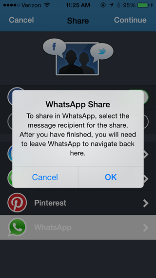

=================================
WhatsApp Sharing (Via URL Scheme)
=================================

Installation
------------

As of release 3.0.3, WhatsApp is available as a Share option that can be easily enabled.

Since WhatsApp does not have a formal API/SDK, no app registration or access tokens are required. Instead, the WhatsApp URL Scheme ("whatsapp://") is used to communicate between the Socialize SDK and WhatsApp.

Configuring WhatsApp in Socialize (SDK)
----------------------------------------

To enable WhatsApp sharing, simply enable it:

.. literalinclude:: snippets/whatsapp-snippets.m
  :start-after: begin-configure-snippet
  :end-before: end-configure-snippet
  :emphasize-lines: 6

.. note:: The WhatsApp app must be installed on a device for WhatsApp sharing to display in the Share dialog. This functionality works on devices only, not in Simulator.

.. note:: Since WhatsApp uses URL Schemes to navigate from your app, there is no callback mechanism to return to your app from WhatsApp once the user has sent the share as a WhatsApp message. Users will be notified of this via a UIAlertView before navigating to WhatsApp.

Posting to WhatsApp on your own
---------------------------------

Should you need to post to WhatsApp on your own, you can do so by using the
direct WhatsApp access methods on the utils classes.

.. literalinclude:: snippets/whatsapp-snippets.m
  :start-after: begin-share-snippet
  :end-before: end-share-snippet
